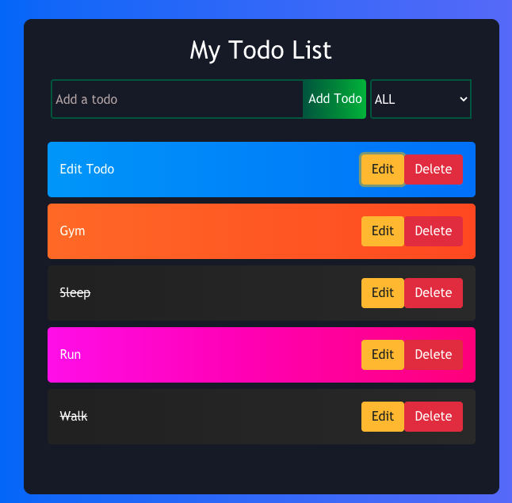
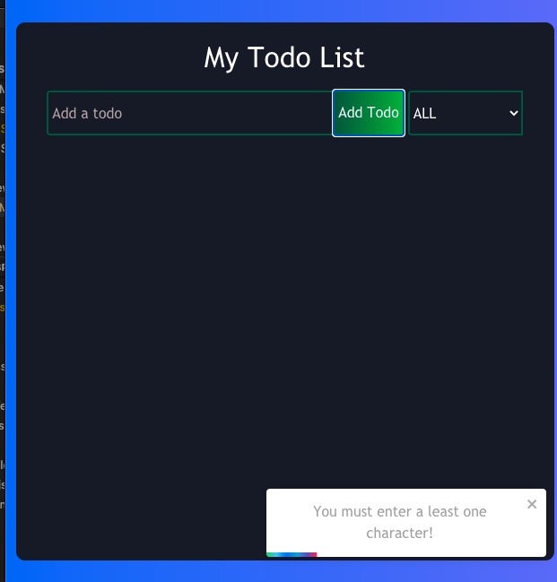

# To-Do-List-React-Sprintboot
This is a web application that provide a beautiful To-Do List for users to manage their tasks. This web app is develop in H2 DataBase, Sprintboot and React.js. 

## Technologies
This project is created with:
Backend
* H2 DataBase (Backend)
* Sprintboot (Backend)
* Maven
* IntelliJ IEDA
* JAVA JDK 11 
* React v17.02 (Frontend)
* NPM v6.14.6
* VSCode

## Demo
* **User can view uncompleted and completed items in the To Do List** 


* **User can mark an item as completed by clicking the text** 


* **User can add an item from the list by clicking the Add Todo Button** 


* **User can add an item from the list by clicking the edit button** 


* **User can delete an item from the list by clicking the delete button** 


* **This program can prevent users from creating an empty todoItem**


## Try it locally
* **Frontend part** 
1. Go to client folder
2. Run the following command

```
$ npm install
$ npm start
```
3. Go to http://localhost:3000/

* **Backend part** 
1. Go to server folder
2. Run the following command to run the server.
```
$ java -jar todo-sprintboot-0.0.1-SNAPSHOT.jar
```
or you can use the following commands to package and run the server
```
$ mvn install
$ cd target
$ java -jar todo-sprintboot-0.0.1-SNAPSHOT.jar
```


## Directory Structure
    Root
    ├── README.md
    │
    ├── client              
    │   └─── src 
    │        ├── index.js
    │        ├── App.js
    │        ├── package.json           # NPM Package file
    │        └── components             # React components
    │           
    │
    └── server/
        ├── src                   # Java Source Files             
        ├── todo-sprintboot-0.0.1-SNAPSHOT.jar                       # Backend JAR file 
        ├── pom.xml                
        ├── mvnw.cmd
        ├── mvnw
        ├── todo-sprintboot.iml
        └── HELP.md                